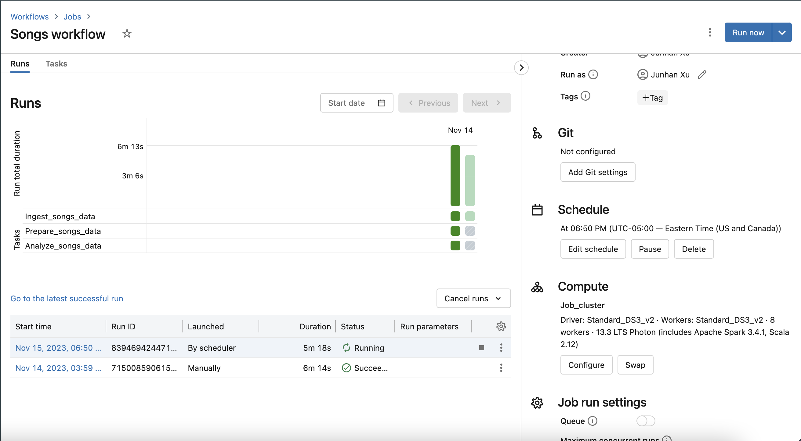
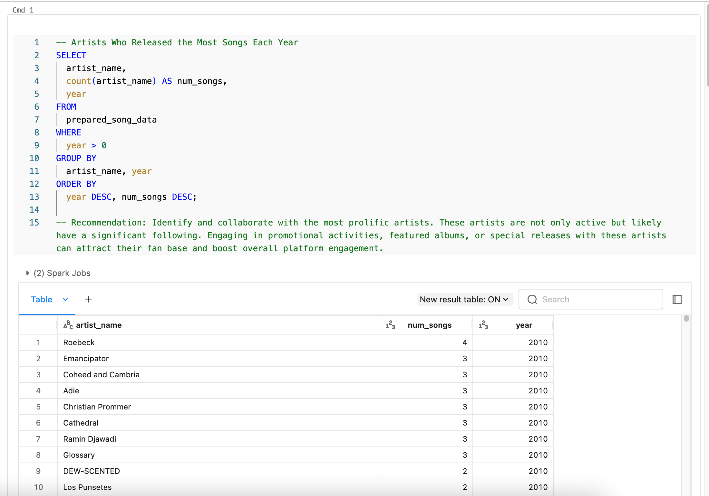
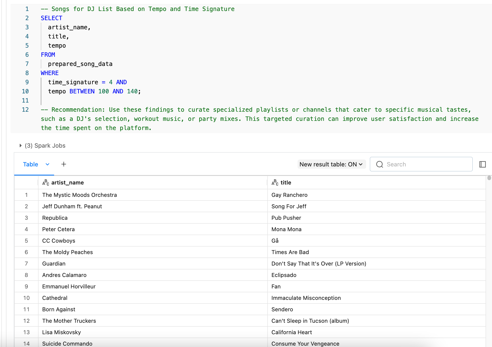
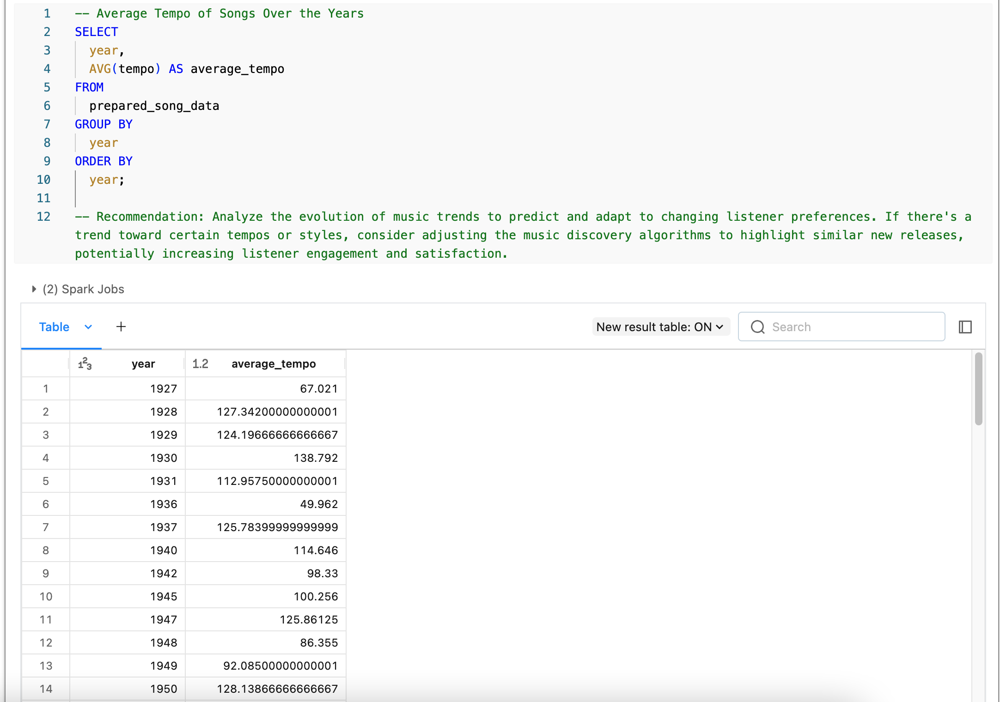
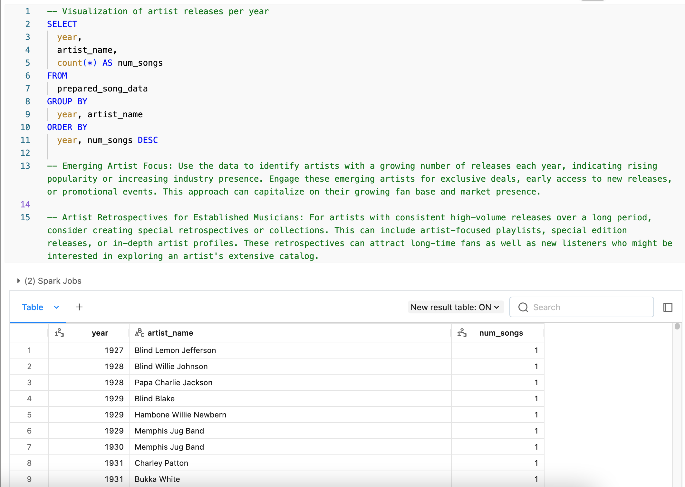

# IDS706-Individual-Project3: Databricks ETL Pipeline Music Data Analysis Pipeline in Databricks

## Project Overview

This project implements a complete data pipeline in Databricks, focusing on the analysis of music data. The pipeline ingests, transforms, and analyzes song data to derive insightful metrics about music trends, artist productivity, and song characteristics. 

## Dependencies

- **Databricks Environment**: A Databricks workspace with necessary permissions.
- **Apache Spark**: The underlying engine for data processing.
- **Delta Lake**: Used for reliable and performant data storage and management.

## Running the Program

1. **Set Up Databricks Environment**: Ensure you have a running Databricks cluster.
2. **Import Notebooks**: Import the provided `.py` and `.sql` files into your Databricks workspace.
3. **Execute Notebooks**: Run `Ingest songs data.py` to ingest data, followed by `Prepare songs data.sql` for data preparation, and finally, `Analyze songs data.sql` for data analysis. I also set up an automated trigger for this pipeline, which is demonstrated in the video.


## Pipeline Stages

### 1. Data Ingestion (`Ingest songs data.py`)

This stage involves reading song data from a CSV file and loading it into a Spark DataFrame. The data includes various fields like artist name, song duration, release year, etc.

### 2. Data Preparation (`Prepare songs data.sql`)

At this stage, the raw data is transformed and cleaned. This includes trimming whitespace, handling negative durations, and filtering out records with missing critical fields. The data is then stored in a Delta table.

#### Demonstration of Delta Lake Time Travel
To showcase the time travel capability of Delta Lake, consider the following scenario:
- **Scenario**: After a series of data transformations, it's discovered that a critical error was introduced in the latest version of the data.
- **Action**: Using Delta Lake's time travel feature, we can query a previous version of the data before the error was introduced.
  
  Example query using time travel:
  ```sql
  SELECT * FROM prepared_song_data VERSION AS OF 3; -- Replace '3' with the specific version number
  ```

- **Outcome**: This feature allows for a quick resolution by accessing the correct data version, ensuring minimal disruption and maintaining data integrity.

#### Data Validation Checks
To ensure the quality of the data in the pipeline, the following data validation checks are implemented:
1. **Null Checks**: We ensure critical fields like `year`, `artist_name`, and `song_id` are not null. This prevents incomplete records from skewing the analysis.
   
   Example Check:
   ```python
   .filter(col("year").isNotNull() & col("artist_name").isNotNull())
   ```
2. **Range Checks**: For numerical fields like `duration`, checks are in place to ensure values are within reasonable bounds (e.g., duration is positive).
3. **Consistency Checks**: The data is checked for logical consistency, such as ensuring the `year` of a song is not in the future.

#### Data Transformations
Effective data transformation is crucial for preparing the data for analysis. The following transformations are applied:
1. **Trimming Whitespace**: Trimming any leading or trailing whitespace from string fields like `artist_name` and `title` to ensure consistency.
   
   Example Transformation:
   ```sql
   TRIM(artist_name) AS artist_name
   ```
2. **Handling Negative Values**: Negative values in fields like `duration` are set to NULL, as they don't make logical sense in the context of song data.
3. **Partitioning Data**: The prepared data is partitioned by `year` for efficient storage and query performance in Delta Lake.

### 3. Data Analysis (`Analyze songs data.sql`)

The analysis stage involves running SQL queries on the prepared data. This includes identifying top artists by year, finding suitable songs for DJ lists based on tempo and time signature, and other insights.

## Data-Driven Recommendations

Based on the analysis, the following recommendations are proposed for the management team:

1. **Artists Who Released the Most Songs Each Year**: Identify and collaborate with the most prolific artists. These artists are not only active but likely have a significant following. Engaging in promotional activities, featured albums, or special releases with these artists can attract their fan base and boost overall platform engagement.  


2. **Songs for DJ List Based on Tempo and Time Signature**: Use these findings to curate specialized playlists or channels that cater to specific musical tastes, such as a DJ's selection, workout music, or party mixes. This targeted curation can improve user satisfaction and increase the time spent on the platform.  


3. **Average Tempo of Songs Over the Years**: Analyze the evolution of music trends to predict and adapt to changing listener preferences. If there's a trend toward certain tempos or styles, consider adjusting the music discovery algorithms to highlight similar new releases, potentially increasing listener engagement and satisfaction.  


4. **Visualization of artist releases per year**: Emerging Artist Focus: Use the data to identify artists with a growing number of releases each year, indicating rising popularity or increasing industry presence. Engage these emerging artists for exclusive deals, early access to new releases, or promotional events. This approach can capitalize on their growing fan base and market presence.  


5. **Visualization of artist releases per year**: Artist Retrospectives for Established Musicians: For artists with consistent high-volume releases over a long period, consider creating special retrospectives or collections. This can include artist-focused playlists, special edition releases, or in-depth artist profiles. These retrospectives can attract long-time fans as well as new listeners who might be interested in exploring an artist's extensive catalog.  


## Conclusion

This project leverages the power of Databricks and Spark SQL for efficient and insightful music data analysis. The recommendations provided can guide strategic decisions in music production and distribution, helping to cater to audience preferences and market trends.